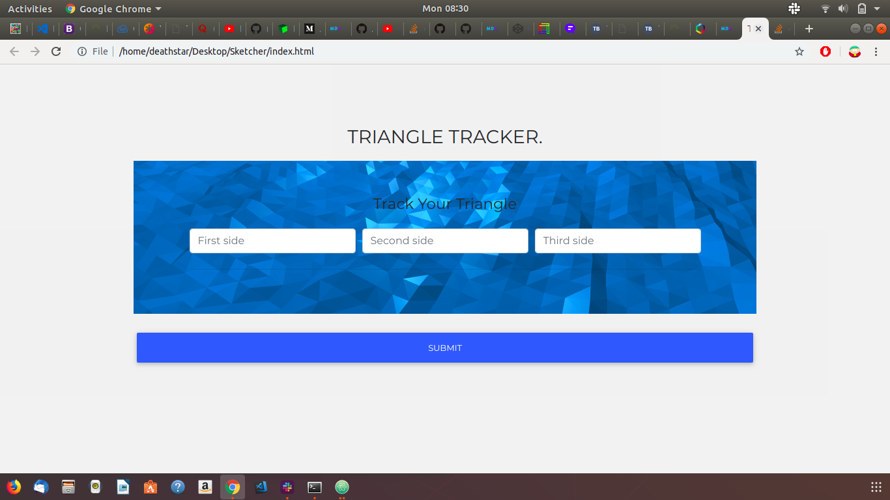

# TRIANGLE TRACKER
#### This is TRACK-IT, a project to track triangles. from a user and output whether or not it is a Triangle. It takes it a step further and tells what kind of triangle it is, Equilateral, Isosceles or Scalene. ::
#### By **KENNETH MUCHIRI**

## Description
This is a simple web game that takes from a user and output whether or not it is a Triangle. It takes it a step further and tells what kind of triangle it is, Equilateral, Isosceles or Scalene.
## Project live site
 https://mucciz.github.io/Track-IT-/
## Setup instructions
* No Setup is needed here, just play the game and enjoy.
## Behavior Driven Development
<table>
   <tr>
     <th>Behavior</th>
     <th>Input</th>
     <th>Output</th>
   </tr>
   <tr>
       <td>All sides equal</td>
       <td>[2,2,2]</td>
       <td>Equilateral</td>
   </tr>
   <tr>
       <td>Two sides equal</td>
       <td>[2,2,3]</td>
       <td>Isosceles</td>
   </tr>
   <tr>
       <td>None equal</td>
       <td>[2,4,3]</td>
       <td>Scalene</td>
   </tr>
   <tr>
       <td>Sum of two values<= third value </td>
       <td>[1,2,5]</td>
       <td>No triangle</td>
   </tr>
</table>

## Technologies Used
* HTML
* CSS
* MDB
* JavaScript
## Support and contact details
contact me @ kenmucciz8@gmail.com
### License
*MIT LICENSE
Copyright &copy; 2019.All rigths reserved
